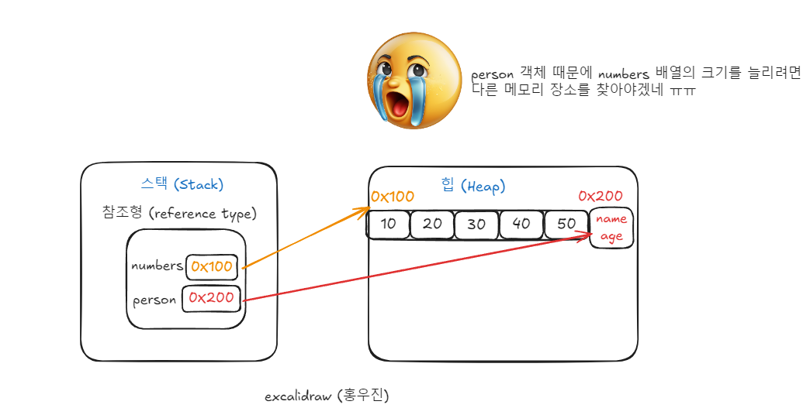

# 참조


# 다차원 배열
---
### **1. 다차원 배열이란? (Multidimensional Array)**
다차원 배열은 배열의 배열이라고 정의를 많이 합니다. 1차원 배열 여러개가 모여 다차원 배열을 이루는 구조를 말합니다. 다차원 배열의 기본적인 형태인 2차원 배열은 행과 열로 구성된 구조를 일컫 습니다. 테이블과 같은 형태를 띄우고,   이는 행과 열로 구성된 배열 구조를 가집니다. 이를 통해 데이터를 행렬 형태로 표현하거나, 더 높은 차원의 배열을 생성하여 복잡한 데이터를 처리할 수 있습니다.
```
// 3행 4열의 배열을 선언과 초기화
 int[][] arr2ds = {
            {1, 2, 3, 4},
            {5, 6, 7, 8},
            {9, 10, 11, 12}
    };

```

- **테이블**

#### **1.1. 특징**

 - **연속된 메모리 할당:** 


- **정해진 크기:** 배열은 고정된 크기를 가지며, 생성 시 


### **2. 다차원 배열과 메모리 상관관계**

- **정해진 크기:**

#### **2.1. 메모리 구조**

- 
Address:
- The address of an array refers to the memory location where the array is stored in the computer's memory.
- The address of an array is typically the memory location of the first element (index 0) of the array.
- The address of an array element can be calculated based on the element's index, the size of each element, and the starting address of the array.
- The formula to calculate the address of an element at index i is: Address = BaseAddress + i * SizeOfElement, where BaseAddress is the starting address of the array.

여기서 오프셋은 배열의 시작 주소(0x100)에서 각 요소가 떨어져 있는 상대적인 위치입니다.