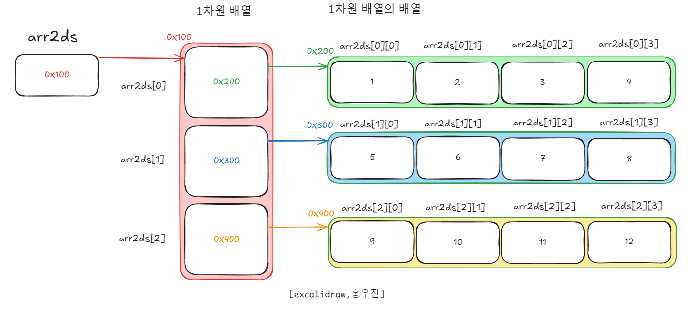
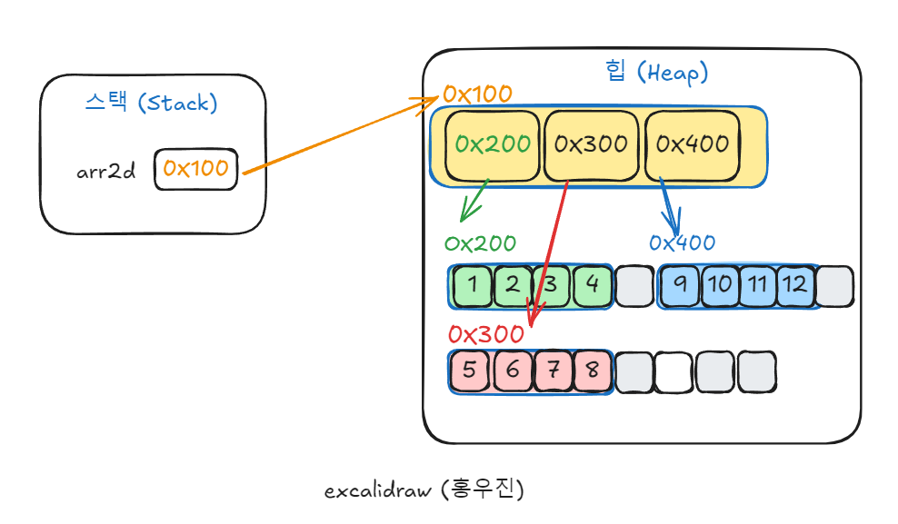

# 참조


# 다차원 배열
---
### **1. 다차원 배열이란? (Multidimensional Array)**
다차원 배열은 배열의 배열이라고 정의를 많이 합니다. 1차원 배열 여러개가 모여 더 높은 차원의 배열을 이루는 구조를 말합니다. 다차원 배열의 기본적인 형태인 2차원 배열은 행과 열로 구성된 구조를 일컫 습니다. 테이블과 같은 형태를 띄우고, 이는 행과 열로 구성된 배열 구조를 가집니다. 이를 통해 데이터를 행렬 형태로 표현하거나, 더 높은 차원의 배열을 생성하여 복잡한 데이터를 처리할 수 있습니다.


**차원 수:**
- **1차원 배열:** 리스트 형태로 데이터를 저장하며, 요소가 연속적으로 나열됩니다.
- **2차원 배열:** 행과 열로 구성된 배열로, 테이블이나 행렬과 같은 구조를 가집니다
- **3차원 이상 배열:** 추가적인 차원을 가짐으로써 더 복잡한 데이터 구조를 표현할 수 있습니다. 예를 들어, 3차원 배열은 행, 열, 깊이로 구성됩니다.

아래 그림과 같이 2차원 배열을 선언과 초기화를 하겠습니다.
```
// 3행 4열의 배열을 선언과 초기화
 int[][] arr2ds = {
            {1, 2, 3, 4},
            {5, 6, 7, 8},
            {9, 10, 11, 12}
    };

```




- **테이블**

#### **1.1. 특징**

 - **연속된 메모리 할당:** 


- **정해진 크기:** 배열은 고정된 크기를 가지며, 생성 시 


### **2. 다차원 배열과 메모리 상관관계**

- **정해진 크기:**

#### **2.1. 메모리 할당**
2차원 메모리 할당에 대해 그림으로 자세히 알아보겠습니다.



스택 메모리:

arr2d라는 참조 변수가 생성되고, 이 변수는 힙 메모리의 0x100 같은 주소를 가리킵니다.
힙 메모리:

0x100에 1차원 배열이 생성됩니다. 이 배열은 각각의 행을 가리키는 참조값(주소)을 저장합니다. 예를 들어, arr2d[0]은 0x200, arr2d[1]은 0x300, arr2d[2]은 0x400을 가리킵니다.
0x200, 0x300, 0x400에는 각각의 행 배열이 저장됩니다. 예를 들어, 0x200에는 첫 번째 행 {1, 2, 3, 4}가 저장되고, 0x300에는 두 번째 행 {5, 6, 7, 8}이 저장됩니다.
참조 변수의 역할
이때, arr2d[0], arr2d[1], arr2d[2]는 변수가 아닙니다. 이들은 참조 배열의 요소입니다. 각각의 참조 배열의 요소는 **힙 메모리에 저장된 행 배열을 가리키는 참조값(주소)**을 나타냅니다.

즉, arr2d[0]은 첫 번째 행을 가리키는 참조값을 가지고 있으며, 이 값은 실제로 힙 메모리에 저장된 첫 번째 행 배열(예: 주소 0x200)을 가리킵니다.

arr2d[0]은 실제로 스택에 저장되는 로컬 변수가 아니라, 힙 메모리에 있는 참조 배열의 일부입니다. 이 참조 배열은 각 행 배열의 주소를 저장하고 있습니다.
왜 스택에 저장되지 않나요?
스택에 저장되는 것은 로컬 변수들입니다. 하지만 arr2d[0], arr2d[1], arr2d[2]는 단순한 변수들이 아니라 배열의 요소이기 때문에, 힙 메모리에 존재하는 배열의 참조값으로 저장됩니다.

로컬 변수인 arr2d는 스택에 저장되지만, 이 변수는 힙 메모리의 배열 객체를 가리킵니다.
각 행 배열의 주소(참조값)**가 저장된 객체 배열(예: 0x100)은 힙 메모리에 존재합니다.
결론
다차원 배열에서 arr2d[0], arr2d[1], arr2d[2]는 스택에 저장되는 로컬 변수가 아닙니다. 이들은 힙 메모리에 있는 객체 배열의 참조값입니다.
이 참조값들은 각 행 배열의 시작 주소를 가리킵니다. 각 행 배열 자체도 힙 메모리에 저장되며, 이 모든 과정은 힙 메모리에서 이루어집니다.
스택에는 참조 변수 arr2d만 저장되고, 이 변수는 힙에 있는 참조 배열(객체 배열)을 가리킵니다.

Address:
- The address of an array refers to the memory location where the array is stored in the computer's memory.
- The address of an array is typically the memory location of the first element (index 0) of the array.
- The address of an array element can be calculated based on the element's index, the size of each element, and the starting address of the array.
- The formula to calculate the address of an element at index i is: Address = BaseAddress + i * SizeOfElement, where BaseAddress is the starting address of the array.

여기서 오프셋은 배열의 시작 주소(0x100)에서 각 요소가 떨어져 있는 상대적인 위치입니다.
